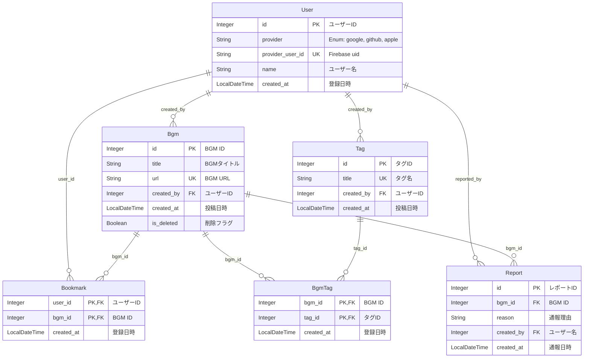

## ER 図

```mermaid
erDiagram

User {
Integer id PK "ユーザーID"
String provider "Enum: google, github, apple"
String provider_user_id UK "Firebase uid"
String name "ユーザー名"
LocalDateTime created_at "登録日時"
}

Bgm {
Integer id PK "BGM ID"
String title "BGMタイトル"
String url UK "BGM URL"
Integer created_by FK "ユーザーID"
LocalDateTime created_at "投稿日時"
Boolean is_deleted "削除フラグ"
}

Bookmark {
Integer user_id PK,FK "ユーザーID"
Integer bgm_id PK,FK "BGM ID"
LocalDateTime created_at "登録日時"
}

Tag {
Integer id PK "タグID"
String title UK "タグ名"
Integer created_by FK "ユーザーID"
LocalDateTime created_at "投稿日時"
}

BgmTag {
Integer bgm_id PK,FK "BGM ID"
Integer tag_id PK,FK "タグID"
LocalDateTime created_at "登録日時"
}

Report {
Integer id PK "レポートID"
Integer bgm_id FK "BGM ID"
String reason "通報理由"
Integer created_by FK "ユーザー名"
LocalDateTime created_at "通報日時"
}

User ||--o{ Bgm : created_by
User ||--o{ Bookmark : user_id
User ||--o{ Tag : created_by
User ||--o{ Report : reported_by
Bgm ||--o{ Bookmark : bgm_id
Bgm ||--o{ BgmTag : bgm_id
Bgm ||--o{ Report : bgm_id
Tag ||--o{ BgmTag : tag_id
```
