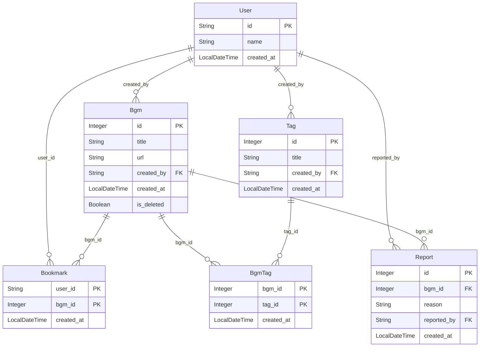

```mermaid
erDiagram

User {
String id PK
String name
LocalDateTime created_at
}

Bgm {
Integer id PK
String title
String url
String created_by FK
LocalDateTime created_at
Boolean is_deleted
}

Bookmark {
String user_id PK
Integer bgm_id PK
LocalDateTime created_at
}

Tag {
Integer id PK
String title
String created_by FK
LocalDateTime created_at
}

BgmTag {
Integer bgm_id PK
Integer tag_id PK
LocalDateTime created_at
}

Report {
Integer id PK
Integer bgm_id FK
String reason
String reported_by FK
LocalDateTime created_at
}

User ||--o{ Bgm : created_by
User ||--o{ Bookmark : user_id
User ||--o{ Tag : created_by
User ||--o{ Report : reported_by
Bgm ||--o{ Bookmark : bgm_id
Bgm ||--o{ BgmTag : bgm_id
Bgm ||--o{ Report : bgm_id
Tag ||--o{ BgmTag : tag_id
```
