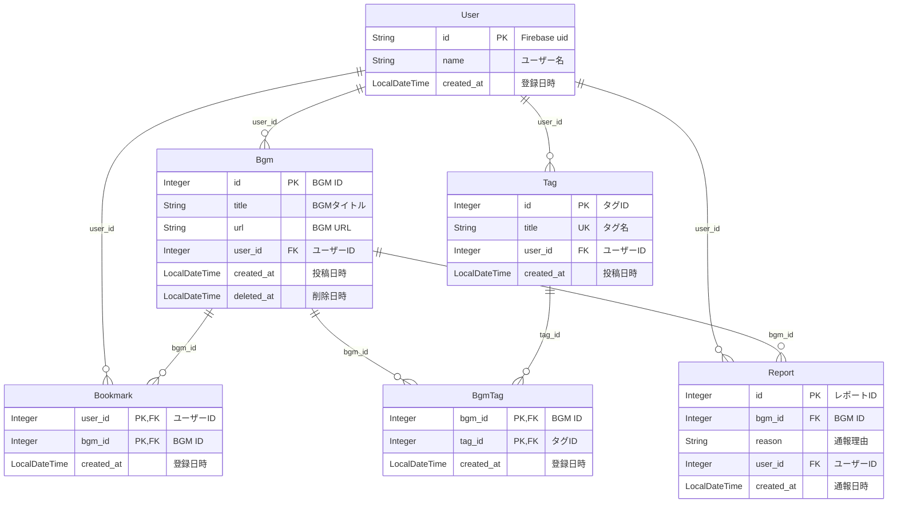

## ER 図

DB に保存するデータ構造(Entity)とその関係(Relation)を記述します。

## 補足

- BGM の削除について
  - BGM データは物理削除せず論理削除する
    - Report テーブルで BGM の id が紐づいている&記録として残しておくため
  - `Bgm` テーブルの `url` と `deleted_at` に対して複合ユニーク制約を持たせる
    - 一度論理削除した URL を別ユーザーが再投稿できるようにするため(`url` だけユニーク制約を持たせると、再投稿できなくなる)
- タグの削除について
  - 検索しやすいように、タグは他の曲とも共有させる
  - よって、タグの削除は BGM との紐付けを解除するだけで、タグ自体は削除しない
