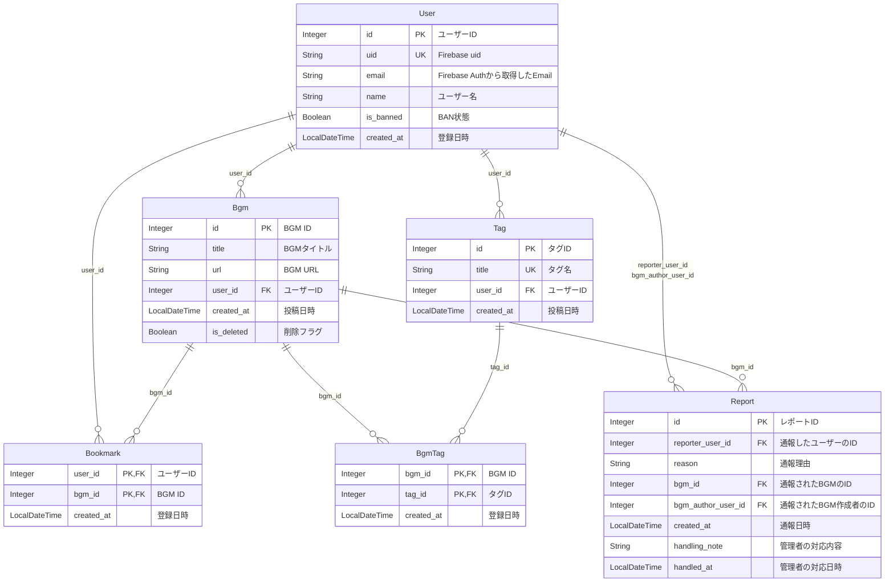

## ER 図

DB に保存するデータ構造(Entity)とその関係(Relation)を記述します。

```mermaid
erDiagram

User {
Integer id PK "ユーザーID"
String uid UK "Firebase uid"
String email "Firebase Authから取得したEmail"
String name "ユーザー名"
Boolean is_banned "BAN状態"
LocalDateTime created_at "登録日時"
}

Bgm {
Integer id PK "BGM ID"
String title "BGMタイトル"
String url "BGM URL"
Integer user_id FK "ユーザーID"
LocalDateTime created_at "投稿日時"
Boolean is_deleted "削除フラグ"
}

Bookmark {
Integer user_id PK,FK "ユーザーID"
Integer bgm_id PK,FK "BGM ID"
LocalDateTime created_at "登録日時"
}

Tag {
Integer id PK "タグID"
String title UK "タグ名"
Integer user_id FK "ユーザーID"
LocalDateTime created_at "投稿日時"
}

BgmTag {
Integer bgm_id PK,FK "BGM ID"
Integer tag_id PK,FK "タグID"
LocalDateTime created_at "登録日時"
}

Report {
Integer id PK "レポートID"
Integer reporter_user_id FK "通報したユーザーのID"
String reason "通報理由"
Integer bgm_id FK "通報されたBGMのID"
Integer bgm_author_user_id FK "通報されたBGM作成者のID"
LocalDateTime created_at "通報日時"
String handling_note "管理者の対応内容"
LocalDateTime handled_at "管理者の対応日時"
}

User ||--o{ Bgm : user_id
User ||--o{ Bookmark : user_id
User ||--o{ Tag : user_id
User ||--o{ Report : "reporter_user_id<br />bgm_author_user_id"
Bgm ||--o{ Bookmark : bgm_id
Bgm ||--o{ BgmTag : bgm_id
Bgm ||--o{ Report : bgm_id
Tag ||--o{ BgmTag : tag_id
```
