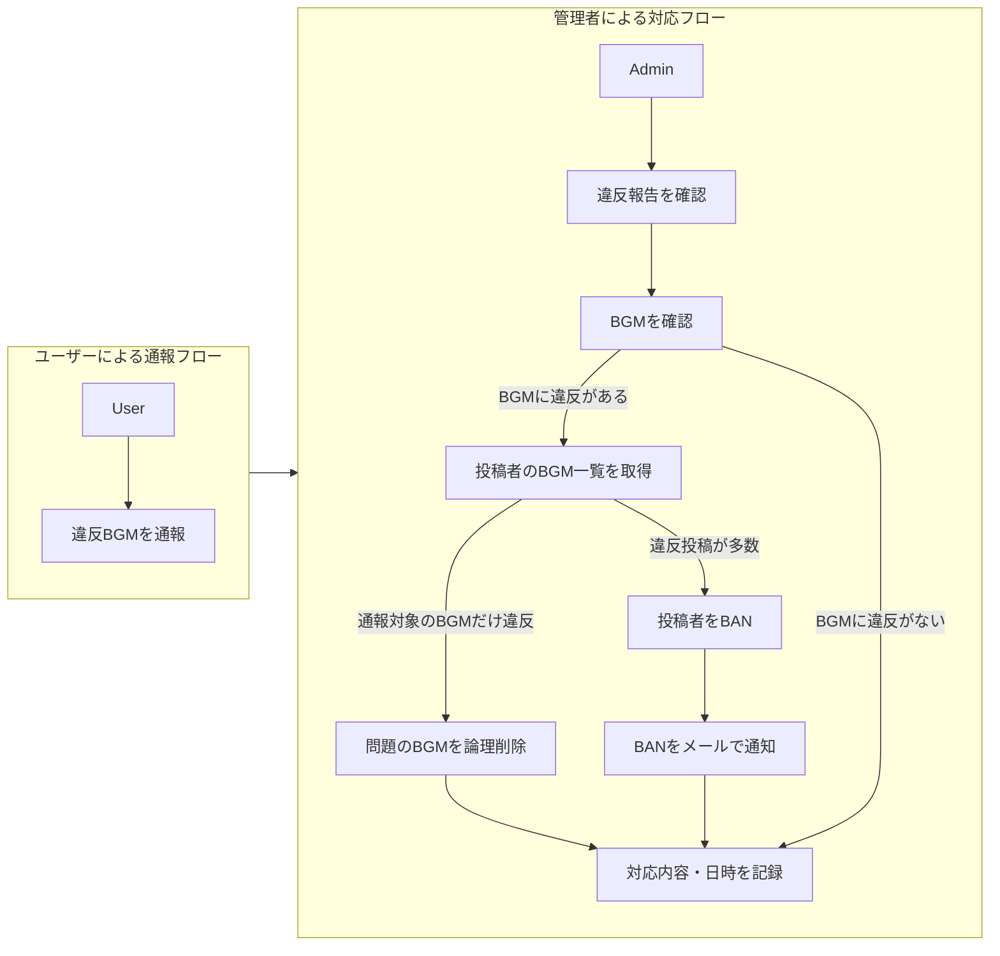

## フローチャート図

複雑な処理のユースケースを記述します。

### 違反 BGM の通報

```mermaid
flowchart LR
subgraph reportFlow[ユーザーによる通報フロー]
  User --> reportBgm[違反BGMを通報]
end

reportFlow --> resolveFlow

subgraph resolveFlow[管理者による対応フロー]
  Admin --> checkReport[違反報告を確認]
  checkReport --> checkBgm[BGMを確認]
  checkBgm -->|BGMに違反がある| fetchBgmList[投稿者のBGM一覧を取得]
  fetchBgmList -->|通報対象のBGMだけ違反| deleteBgm[問題のBGMを論理削除]
  fetchBgmList -->|違反投稿が多数| banUser[投稿者をBAN]
  banUser --> notifyBan[BANをメールで通知]

  deleteBgm --> addComment[対応内容・日時を記録]
  notifyBan --> addComment
  checkBgm -->|BGMに違反がない| addComment
end
```
