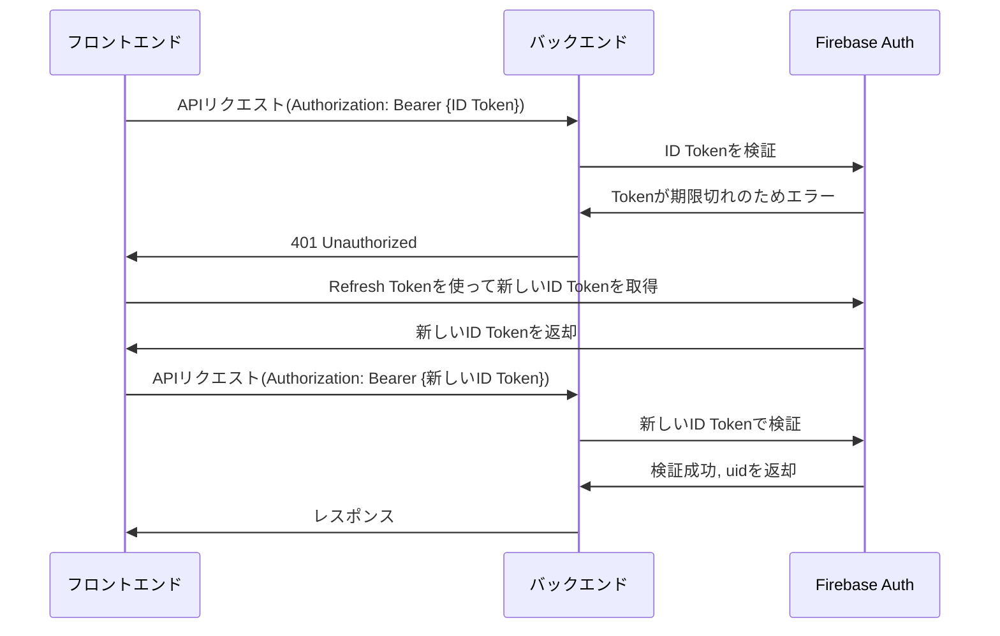

## コマンド

- yaml 形式の OpenAPI 定義ファイルを md 形式に変換

```bash
widdershins --search false --language_tabs 'shell:Shell' --summary ./docs/openapi/openapi.yaml -o ./docs/openapi/openapi.md
```

## トークンの期限が切れた時の Firebase の内部フロー



## Spring のレイヤー

```
[ クライアント ]
      ↓
🔒 Filter（認証・認可）
      ↓
🛡 Interceptor（前後処理など）
      ↓
🚪 Controller（リクエスト受ける入り口）
      ↓
🧠 Service（業務ロジック）
      ↓
💾 Repository（DBアクセス）
```

| レイヤー             | 説明                                                  | 実装クラス                                       |
| -------------------- | ----------------------------------------------------- | ------------------------------------------------ |
| **Filter**           | リクエスト全体をフック（主にセキュリティ・CORS など） | `jakarta.servlet.Filter`, `OncePerRequestFilter` |
| **Interceptor**      | リクエスト/レスポンスの前後処理（ロギング・共通処理） | `HandlerInterceptor`                             |
| **Controller**       | HTTP リクエストを受けて処理を呼び出す                 | `@RestController`, `@GetMapping` など            |
| **Service**          | 業務ロジック（バリデーション、複数処理の連携など）    | `@Service`                                       |
| **Repository**       | DB とのやりとり                                       | `@Repository`, `JpaRepository`, `JdbcTemplate`   |
| **ExceptionHandler** | 例外を捕まえて共通のレスポンス返す                    | `@ControllerAdvice` + `@ExceptionHandler`        |

## Filter と Interceptor の違いと注意点

| レイヤー    | 主な使い方             | よくある処理内容                                   |
| ----------- | ---------------------- | -------------------------------------------------- |
| Filter      | 認証（Authentication） | ID トークンの検証、リクエストの前処理（CORS など） |
| Interceptor | 認可（Authorization）  | ロール確認、リクエストログ、ユーザー情報の保持     |

ただ、今回のように Firebase Authentication を使用する際は：

- 認証（トークン検証） → Filter（FirebaseAuthFilter）
- 認可（管理者・投稿者のチェック） → Spring Security の @PreAuthorize や .hasRole() を使う方が標準的

Interceptor を使って実装できるが、Spring Security と連携しづらくて二重管理になりがち。

結論：
今回は Interceptor 実装しなくてよい。また、将来的に必要になったら検討してもよいが、基本は Spring Security に「ロール」まで渡せば @PreAuthorize("hasRole('ADMIN')") で済む。

## 各レイヤーにおけるエラーの書き方

| レイヤー    | エラーの書き方                                                     |
| ----------- | ------------------------------------------------------------------ |
| Filter      | `response.setStatus(401)`、`return`                                |
| Controller  | `throw new NotFoundException()`                                    |
| Service     | `throw new BusinessException()`                                    |
| Interceptor | `throw new AccessDeniedException()` or 直接 `response.sendError()` |

Filter は 「Servlet レベル」 の処理（Spring の上層じゃない）。例外を投げても、@ControllerAdvice のような Spring の例外処理機構は通らない。だから、自力でレスポンスをいじる（＝ response.setStatus()）必要がある。

| 場所                          | `@ControllerAdvice` の影響を受ける？             |
| ----------------------------- | ------------------------------------------------ |
| Controller                    | ✅ 受ける                                        |
| Service（Controller 経由）    | ✅ 受ける                                        |
| Repository（Controller 経由） | ✅ 受ける                                        |
| Filter                        | ❌ 受けない                                      |
| Interceptor                   | ⚠️ 受けないケースが多い（Spring の外の場合あり） |

```
[リクエスト]
   ↓
(Filter ← Servletレベル。Springの外側)
   ↓
(Interceptor ← Springの中だけどControllerより前)
   ↓
@Controller / @Service / @Repository
   ↓
(ここで発生した例外は @ControllerAdvice に捕まる)
```

※ControllerAdvice とは、Controller で発生した例外をキャッチして、カスタムレスポンスを返せる機能。

## Firebase と Postman の連携

```
POST https://identitytoolkit.googleapis.com/v1/accounts:signInWithPassword?key=【APIキー】

{
  "email": "test@example.com",
  "password": "password123",
  "returnSecureToken": true
}
```

以下が返却される

```
{
  "idToken": "eyJhbGciOi..."
}
```

idToken を Header に付与してリクエストを送る
