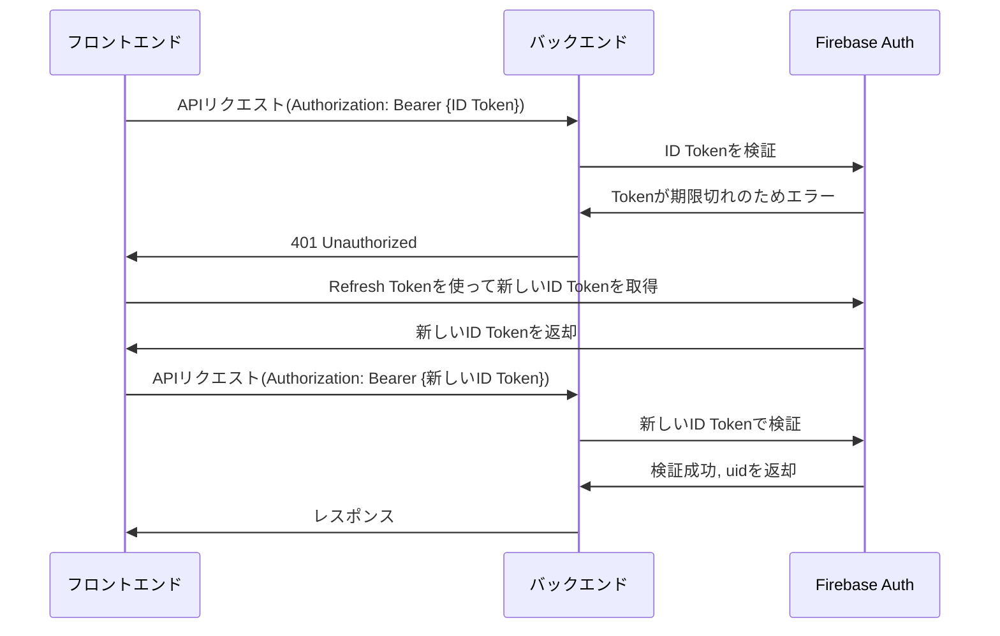

## コマンド

- yaml 形式の OpenAPI 定義ファイルを md 形式に変換

```bash
widdershins --search false --language_tabs 'shell:Shell' --summary ./docs/openapi.yaml -o ./docs/openapi.md
```

### トークンの期限が切れた時の Firebase の内部フロー


