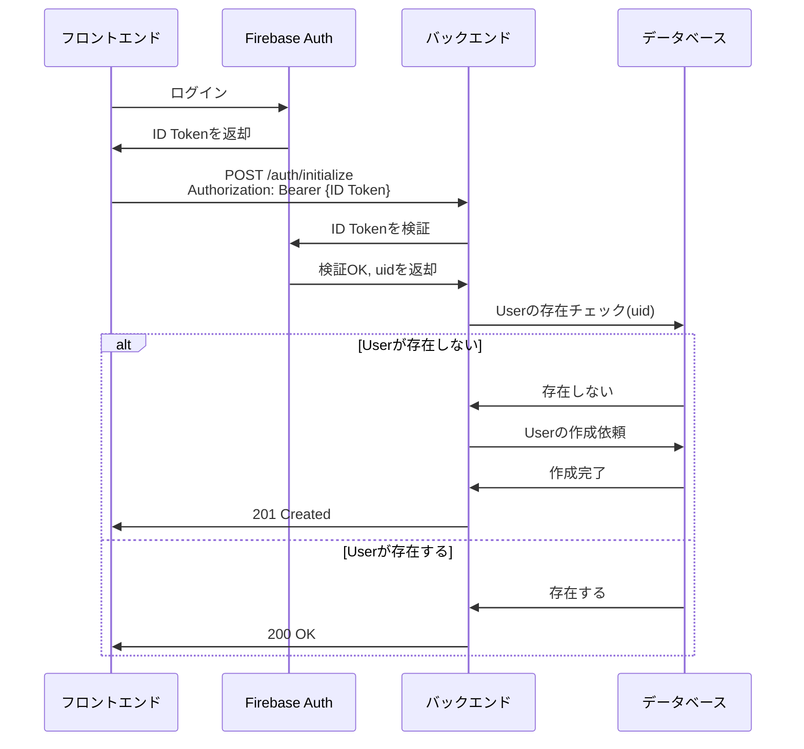
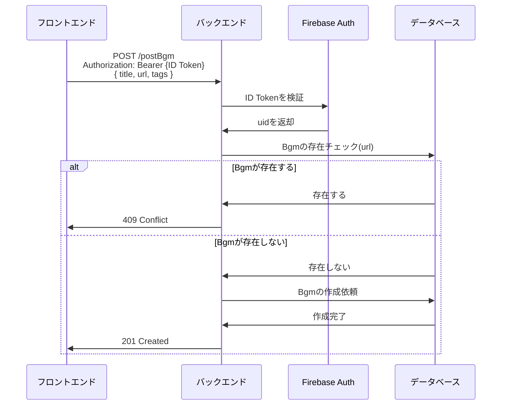
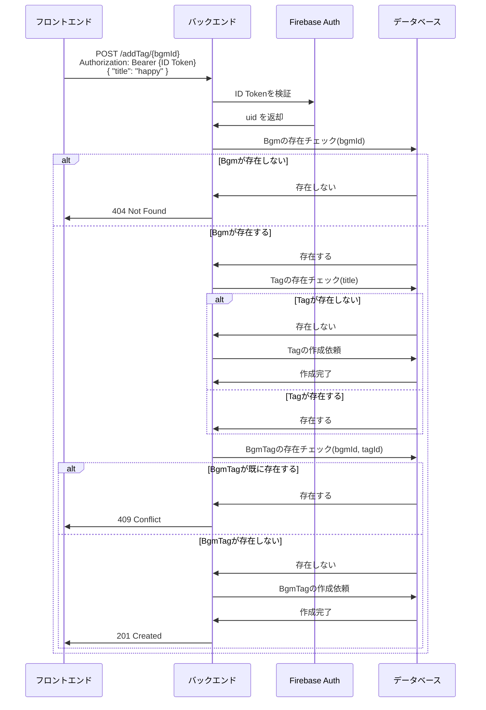
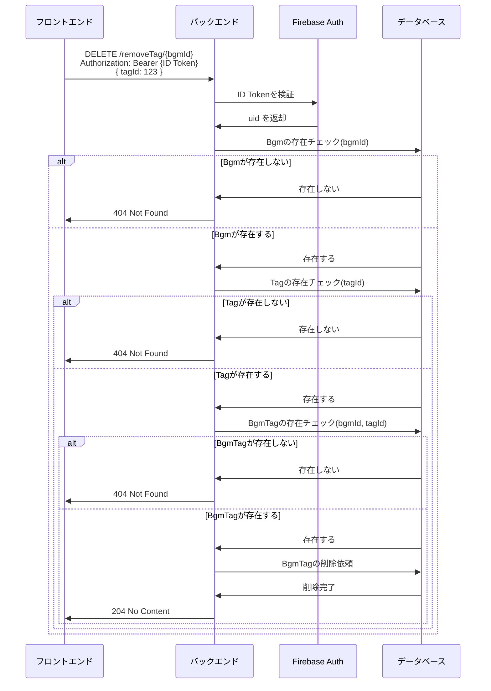
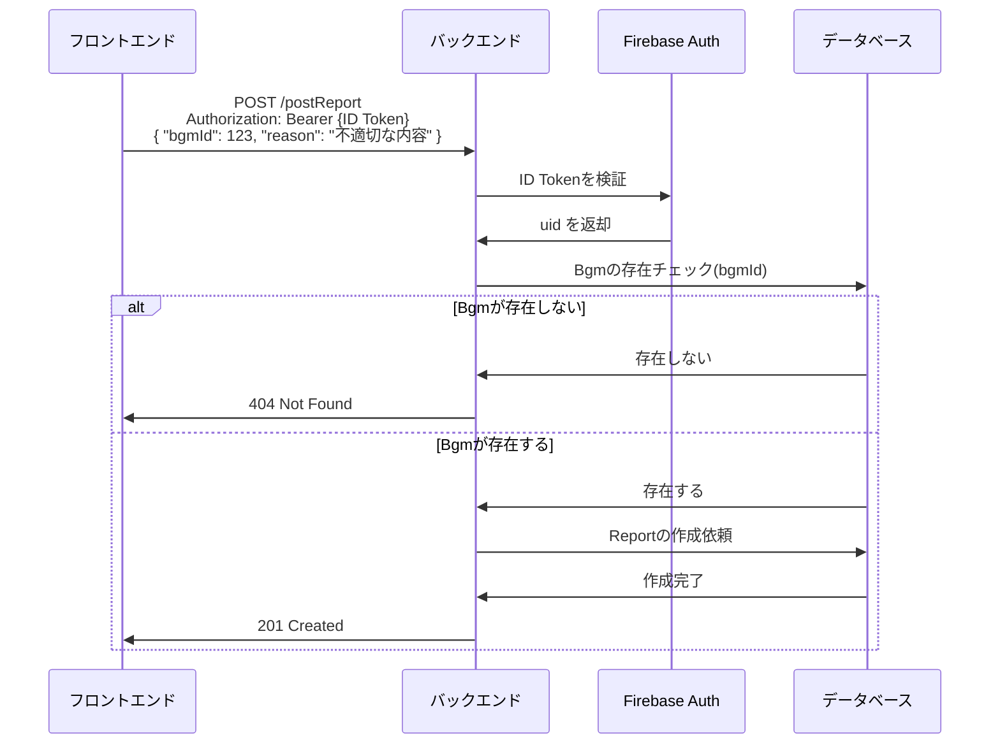

## シーケンス図

代表的な処理のシーケンス図をいくつか記述します。

### 初回ログイン時に User テーブルを作成

```mermaid
sequenceDiagram
  participant FE as フロントエンド
  participant FB as Firebase Auth
  participant BE as バックエンド
  participant DB as データベース

  FE->>FB: ログイン
  FB->>FE: ID Tokenを返却

  FE->>BE: POST /auth/initialize<br />Authorization: Bearer {ID Token}
  BE->>FB: ID Tokenを検証
  FB->>BE: 検証OK, uidを返却
  BE->>DB: Userの存在チェック(uid)

  alt Userが存在しない
    DB->>BE: 存在しない
    BE->>DB: Userの作成依頼
    DB->>BE: 作成完了
    BE->>FE: 201 Created
  else Userが存在する
    DB->>BE: 存在する
    BE->>FE: 200 OK
  end
```

### BGM を投稿

```mermaid
sequenceDiagram
  participant FE as フロントエンド
  participant BE as バックエンド
  participant FB as Firebase Auth
  participant DB as データベース

  FE->>BE: POST /postBgm<br />Authorization: Bearer {ID Token}<br />{ title, url, tags }

  BE->>FB: ID Tokenを検証
  FB->>BE: uidを返却
  BE->>DB: Bgmの存在チェック(url)

  alt Bgmが存在する
    DB->>BE: 存在する
    BE->>FE: 409 Conflict
  else Bgmが存在しない
    DB->>BE: 存在しない
    BE->>DB: Bgmの作成依頼
    DB->>BE: 作成完了
    BE->>FE: 201 Created
  end
```

### タグを追加

```mermaid
sequenceDiagram
  participant FE as フロントエンド
  participant BE as バックエンド
  participant FB as Firebase Auth
  participant DB as データベース

  FE->>BE: POST /addTag/{bgmId}<br />Authorization: Bearer {ID Token}<br />{ "title": "happy" }

  BE->>FB: ID Tokenを検証
  FB->>BE: uid を返却

  BE->>DB: Bgmの存在チェック(bgmId)
  alt Bgmが存在しない
    DB->>BE: 存在しない
    BE->>FE: 404 Not Found
  else Bgmが存在する
    DB->>BE: 存在する

    BE->>DB: Tagの存在チェック(title)
    alt Tagが存在しない
      DB->>BE: 存在しない
      BE->>DB: Tagの作成依頼
      DB->>BE: 作成完了
    else Tagが存在する
      DB->>BE: 存在する
    end

    BE->>DB: BgmTagの存在チェック(bgmId, tagId)
    alt BgmTagが既に存在する
      DB->>BE: 存在する
      BE->>FE: 409 Conflict
    else BgmTagが存在しない
      DB->>BE: 存在しない
      BE->>DB: BgmTagの作成依頼
      DB->>BE: 作成完了
      BE->>FE: 201 Created
    end
  end
```

### BGM からタグを削除

```mermaid
sequenceDiagram
  participant FE as フロントエンド
  participant BE as バックエンド
  participant FB as Firebase Auth
  participant DB as データベース

  FE->>BE: DELETE /removeTag/{bgmId}<br />Authorization: Bearer {ID Token}<br />{ tagId: 123 }

  BE->>FB: ID Tokenを検証
  FB->>BE: uid を返却

  BE->>DB: Bgmの存在チェック(bgmId)
  alt Bgmが存在しない
    DB->>BE: 存在しない
    BE->>FE: 404 Not Found
  else Bgmが存在する
    DB->>BE: 存在する

    BE->>DB: Tagの存在チェック(tagId)
    alt Tagが存在しない
      DB->>BE: 存在しない
      BE->>FE: 404 Not Found
    else Tagが存在する
      DB->>BE: 存在する

      BE->>DB: BgmTagの存在チェック(bgmId, tagId)
      alt BgmTagが存在しない
        DB->>BE: 存在しない
        BE->>FE: 404 Not Found
      else BgmTagが存在する
        DB->>BE: 存在する
        BE->>DB: BgmTagの削除依頼
        DB->>BE: 削除完了
        BE->>FE: 204 No Content
      end
    end
  end
```

### 違反報告

```mermaid
sequenceDiagram
  participant FE as フロントエンド
  participant BE as バックエンド
  participant FB as Firebase Auth
  participant DB as データベース

  FE->>BE: POST /postReport<br />Authorization: Bearer {ID Token}<br />{ "bgmId": 123, "reason": "不適切な内容" }

  BE->>FB: ID Tokenを検証
  FB->>BE: uid を返却

  BE->>DB: Bgmの存在チェック(bgmId)
  alt Bgmが存在しない
    DB->>BE: 存在しない
    BE->>FE: 404 Not Found
  else Bgmが存在する
    DB->>BE: 存在する
    BE->>DB: Reportの作成依頼
    DB->>BE: 作成完了
    BE->>FE: 201 Created
  end
```
