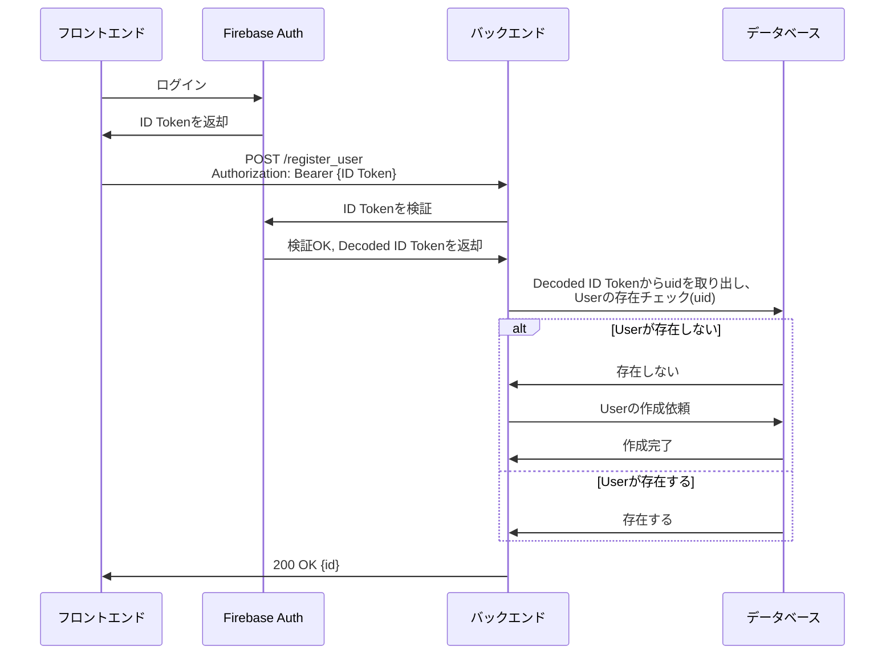
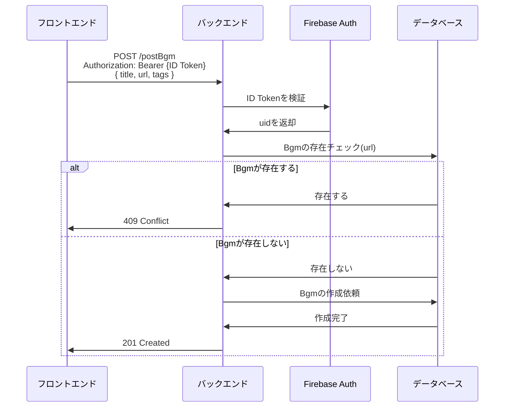
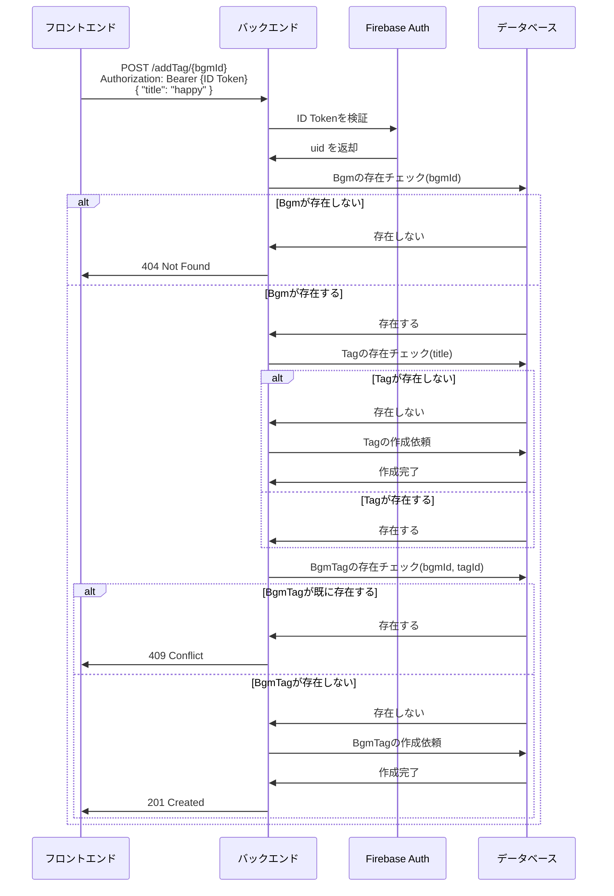
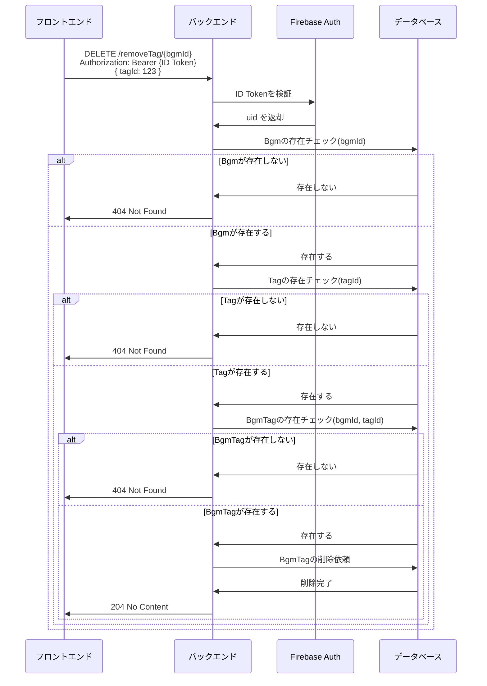
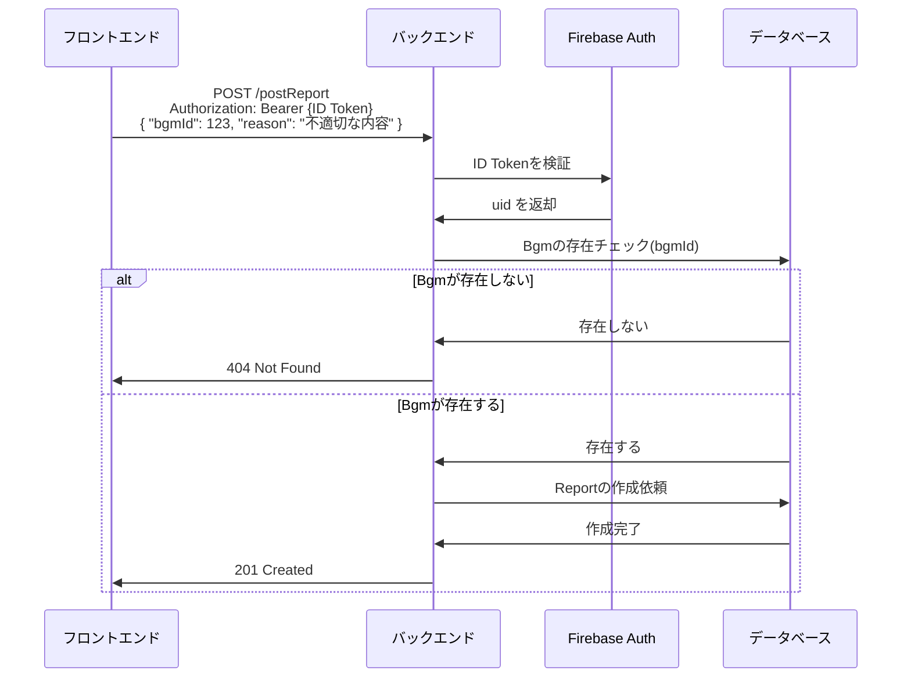

## シーケンス図

### ユーザー情報の登録

> POST /register_user

#### 備考

Firebase Authenticationを使用した実装方法には以下の2つがあるが、今回はクライアント主導型を実装する。

> クライアント主導型：
>
> これは、特にフロントエンド（React, Vueなど）とバックエンドが分離した現代的なアプリケーションで標準的な手法です。
> 未登録のユーザーが、クライアント（Webやアプリ）の画面でメールアドレス・パスワード・名前などを入力する。
> クライアントは、Firebaseのクライアント用SDKを使って、まずFirebase Authenticationに直接ユーザーを登録する。
> Firebaseへの登録が成功すると、FirebaseはクライアントにID Tokenを返す。
> クライアントは、そのID TokenをAuthorizationヘッダーに付けて、Spring BootサーバーのAPI（例: POST
> /register_user）に送信する。
> APIを受け取ったバックエンドは、ID Tokenを検証し、「この人は正しくFirebaseに登録された（またはログインした）ユーザーだ」と確認する。
> バックエンドは、その確認が取れた情報を使って、自社のUserデータベースにレコードを作成（または検索）する。
> バックエンドは、クライアントに内部IDなどを返す。
>
> サーバー主導型：
>
> 未登録のユーザーが、クライアント（Webやアプリ）の画面でメールアドレス・パスワード・名前などを入力する。
> クライアントは、その情報をそのまま私たちのSpring BootサーバーのAPI（例: POST /users/register）に送信する。
> APIを受け取ったバックエンドは、Admin SDKを使って、受け取ったメールアドレスとパスワードでFirebaseに新しいユーザーを作成するよう命令する。
> Firebaseがユーザー作成に成功したら、そのユーザーのUIDをバックエンドに返す。
> バックエンドは、そのUIDと、クライアントから受け取った名前などを使って、自社のUserデータベースにレコードを作成する。
> バックエンドは、クライアントに「登録成功」のレスポンスを返す。
> このフローでは、APIが呼ばれた時点ではユーザーはまだFirebaseに存在しません。APIが、Firebaseへの登録と自社DBへの登録を両方とも行います。

[//]: # (TODO: APIごとにシーケンス図を作成)

### BGM を投稿

### タグを追加

### BGM からタグを削除

### 違反報告

