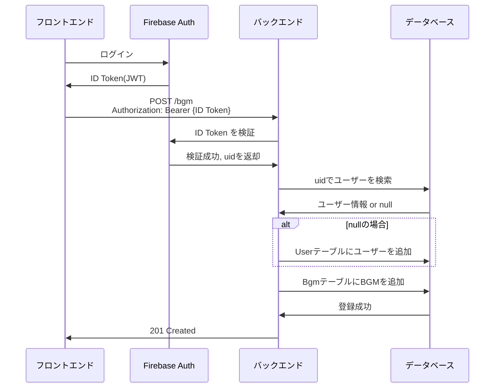

## シーケンス図

認証が必要な処理の流れの例として、「ユーザーがログインして BGM を投稿する」までのフローを記述します。

```mermaid
sequenceDiagram
  participant FE as フロントエンド
  participant Firebase as Firebase Auth
  participant BE as バックエンド
  participant DB as データベース

  FE->>Firebase: ログイン
  Firebase->>FE: ID Token(JWT)

  FE->>BE: POST /bgm<br />Authorization: Bearer {ID Token}
  BE->>Firebase: ID Token を検証
  Firebase->>BE: 検証成功, uidを返却

  BE->>DB: uidでユーザーを検索
  DB->>BE: ユーザー情報 or null

  alt nullの場合
      BE->>DB: Userテーブルにユーザーを追加
  end

  BE->>DB: BgmテーブルにBGMを追加
  DB->>BE: 登録成功

  BE->>FE: 201 Created
```
