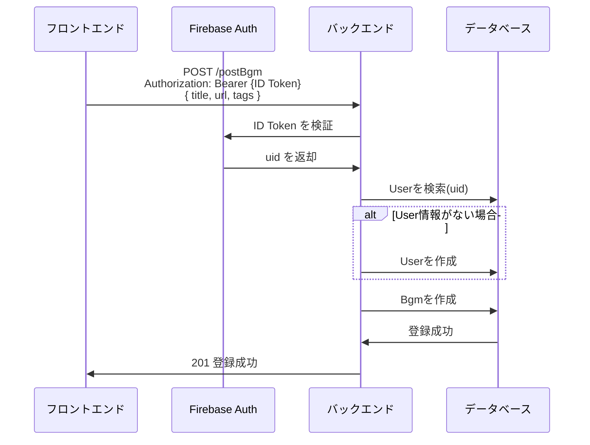
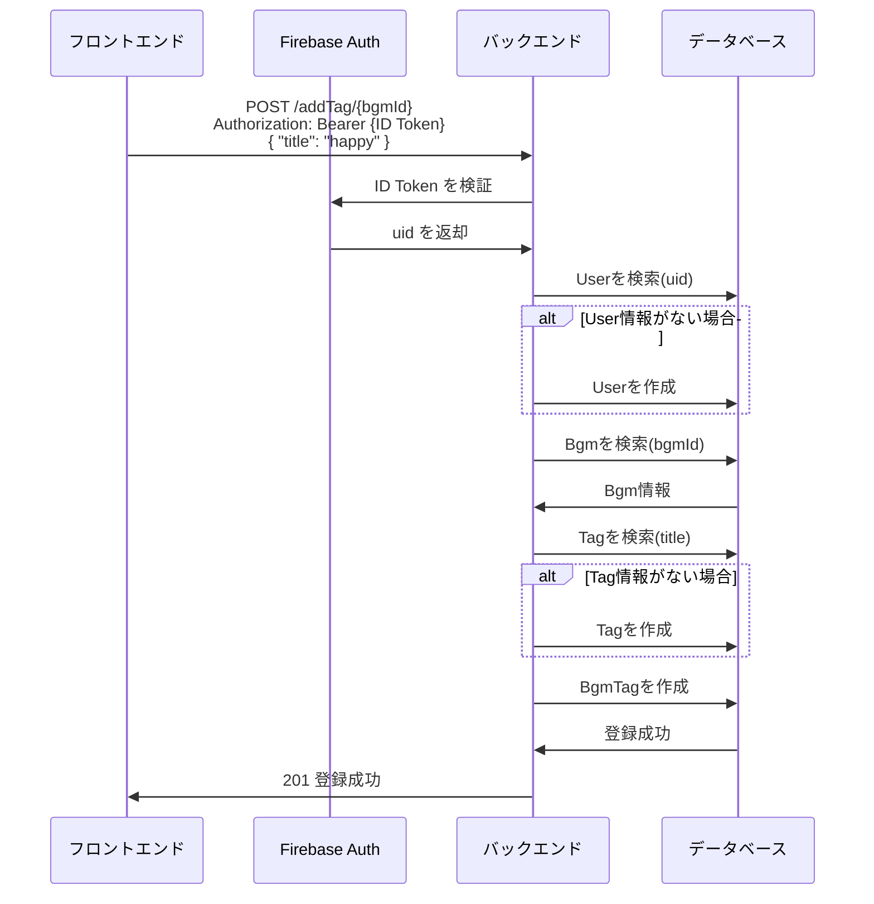
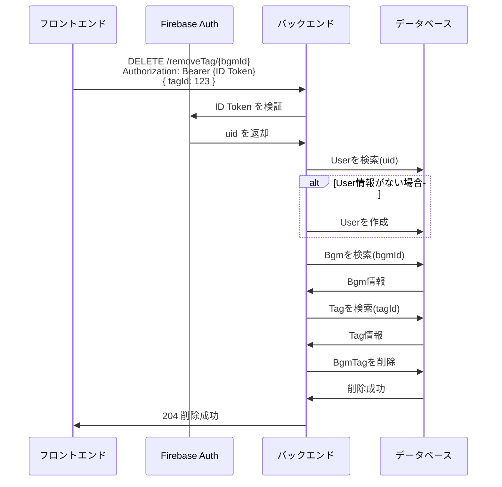
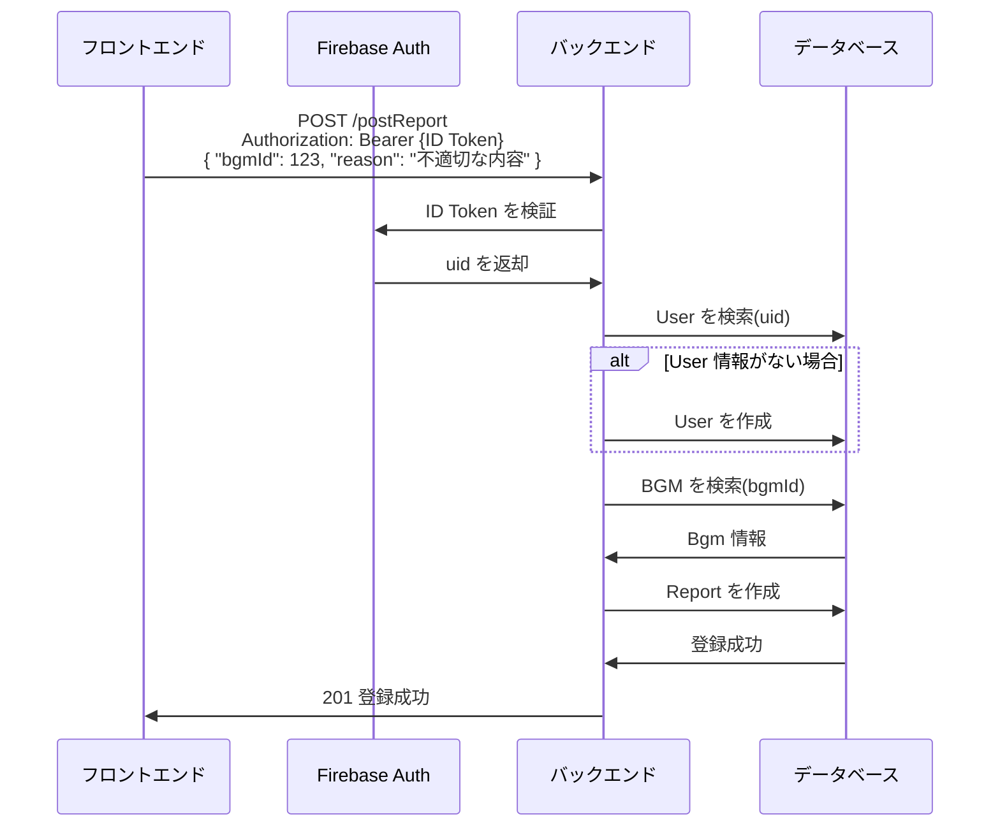
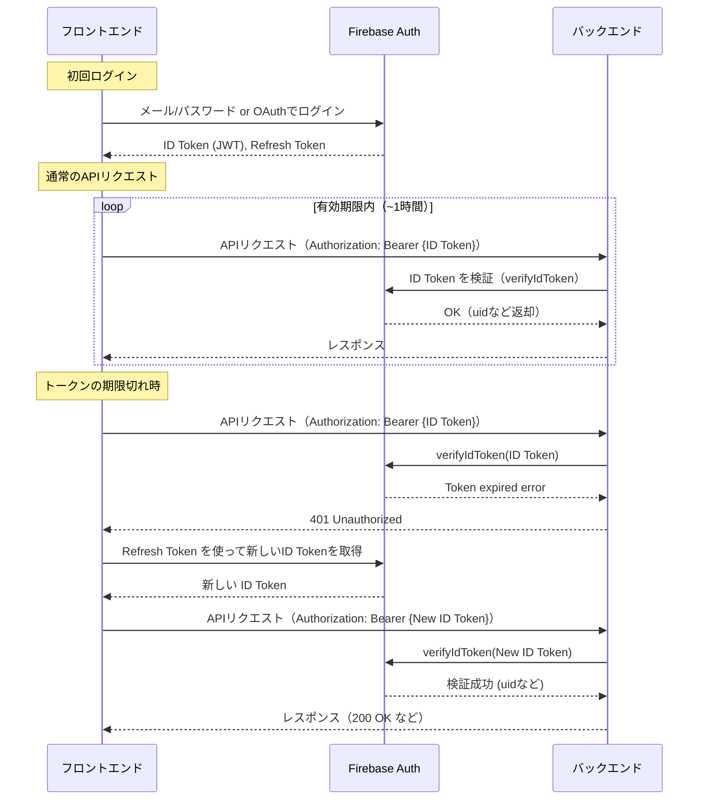

## シーケンス図

代表的な処理のシーケンス図をいくつか記述します。複雑になるため、例外処理は記述しません。

### BGM を投稿

```mermaid
sequenceDiagram
  participant FE as フロントエンド
  participant Firebase as Firebase Auth
  participant BE as バックエンド
  participant DB as データベース

  FE->>BE: POST /postBgm<br />Authorization: Bearer {ID Token}<br />{ title, url, tags }

  BE->>Firebase: ID Token を検証
  Firebase->>BE: uid を返却

  BE->>DB: Userを検索(uid)

  alt User情報がない場合
  BE->>DB: Userを作成
  end

  BE->>DB: Bgmを作成
  DB->>BE: 登録成功

  BE->>FE: 201 登録成功
```

### タグを追加

```mermaid
sequenceDiagram
  participant FE as フロントエンド
  participant Firebase as Firebase Auth
  participant BE as バックエンド
  participant DB as データベース

  FE->>BE: POST /addTag/{bgmId}<br />Authorization: Bearer {ID Token}<br />{ "title": "happy" }

  BE->>Firebase: ID Token を検証
  Firebase->>BE: uid を返却

  BE->>DB: Userを検索(uid)

  alt User情報がない場合
  BE->>DB: Userを作成
  end

  BE->>DB: Bgmを検索(bgmId)
  DB->>BE: Bgm情報

  BE->>DB: Tagを検索(title)

  alt Tag情報がない場合
  BE->>DB: Tagを作成
  end

  BE->>DB: BgmTagを作成
  DB->>BE: 登録成功

  BE->>FE: 201 登録成功
```

### BGM からタグを削除

```mermaid
sequenceDiagram
  participant FE as フロントエンド
  participant Firebase as Firebase Auth
  participant BE as バックエンド
  participant DB as データベース

  FE->>BE: DELETE /removeTag/{bgmId}<br />Authorization: Bearer {ID Token}<br />{ tagId: 123 }

  BE->>Firebase: ID Token を検証
  Firebase->>BE: uid を返却

  BE->>DB: Userを検索(uid)

  alt User情報がない場合
  BE->>DB: Userを作成
  end

  BE->>DB: Bgmを検索(bgmId)
  DB->>BE: Bgm情報

  BE->>DB: Tagを検索(tagId)
  DB->>BE: Tag情報

  BE->>DB: BgmTagを削除
  DB->>BE: 削除成功

  BE->>FE: 204 削除成功
```

### 違反報告

```mermaid
sequenceDiagram
participant FE as フロントエンド
participant Firebase as Firebase Auth
participant BE as バックエンド
participant DB as データベース

FE->>BE: POST /postReport<br />Authorization: Bearer {ID Token}<br />{ "bgmId": 123, "reason": "不適切な内容" }

BE->>Firebase: ID Token を検証
Firebase->>BE: uid を返却

BE->>DB: User を検索(uid)
alt User 情報がない場合
BE->>DB: User を作成
end

BE->>DB: BGM を検索(bgmId)
DB->>BE: Bgm 情報

BE->>DB: Report を作成
DB->>BE: 登録成功

BE->>FE: 201 登録成功
```

### 補足: JWT トークンのライフサイクル

```mermaid
sequenceDiagram
  participant FE as フロントエンド
  participant Firebase as Firebase Auth
  participant BE as バックエンド

  Note over FE: 初回ログイン
  FE->>Firebase: メール/パスワード or OAuthでログイン
  Firebase-->>FE: ID Token (JWT), Refresh Token

  Note over FE: 通常のAPIリクエスト
  loop 有効期限内（~1時間）
    FE->>BE: APIリクエスト（Authorization: Bearer {ID Token}）
    BE->>Firebase: ID Token を検証（verifyIdToken）
    Firebase-->>BE: OK（uidなど返却）
    BE-->>FE: レスポンス
  end

  Note over FE: トークンの期限切れ時

  FE->>BE: APIリクエスト（Authorization: Bearer {ID Token}）
  BE->>Firebase: verifyIdToken(ID Token)
  Firebase-->>BE: Token expired error
  BE-->>FE: 401 Unauthorized

  FE->>Firebase: Refresh Token を使って新しいID Tokenを取得
  Firebase-->>FE: 新しい ID Token

  FE->>BE: APIリクエスト（Authorization: Bearer {New ID Token}）
  BE->>Firebase: verifyIdToken(New ID Token)
  Firebase-->>BE: 検証成功 (uidなど)
  BE-->>FE: レスポンス（200 OK など）
```
